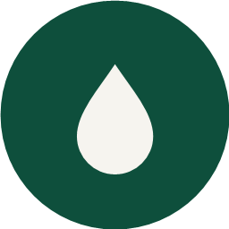
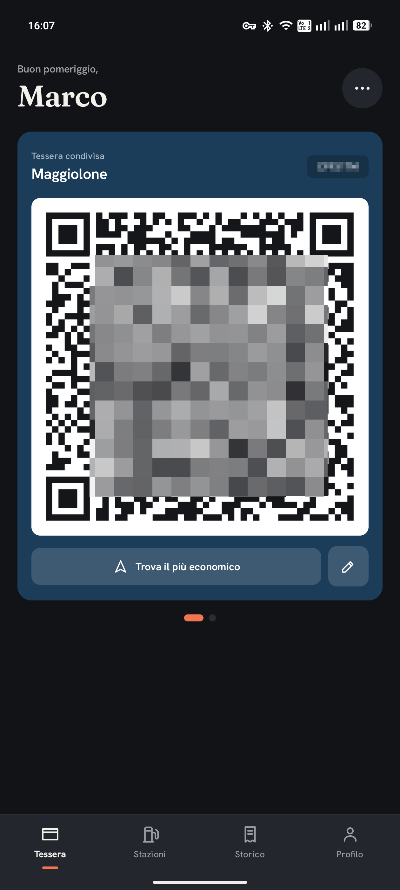
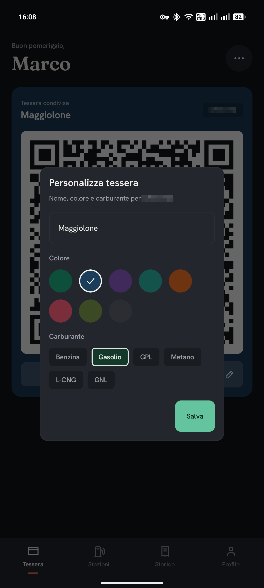
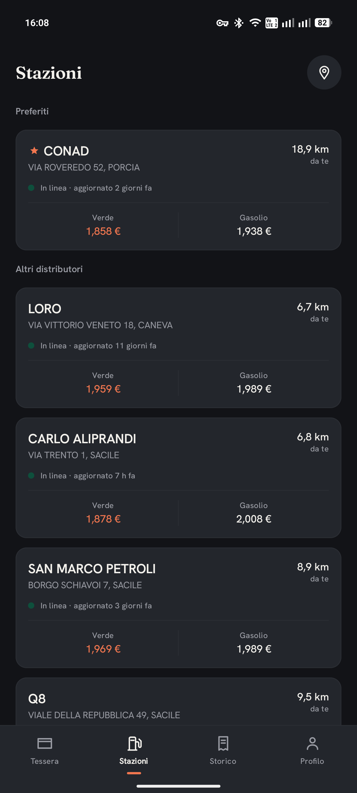
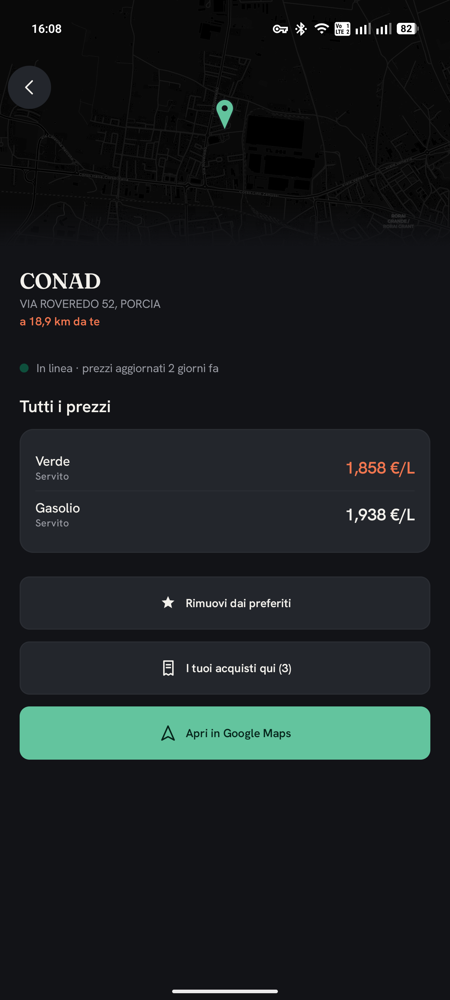
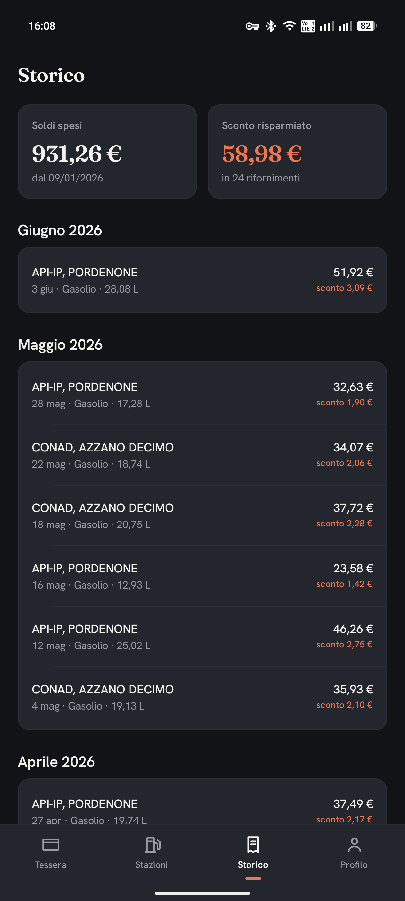

<p align="center">
  
</p>
<h1 align="center">Pieno</h1>
<p align="center">App Android non ufficiale per la tessera carburante agevolata del Friuli Venezia Giulia.</p>
<p align="center">[<a href="README.md">EN</a>|IT]</p>

## Cos'è

Mostra il QR della tessera alla pompa (anche offline), i distributori convenzionati con prezzi e mappa, la ricerca del più economico vicino a te, lo storico dei rifornimenti e l'aggiunta a Google Wallet.

## Scarica

**[Scarica l'APK](https://github.com/macedonga/pieno/releases/download/nightly/pieno.apk)**: build automatica dell'ultimo commit (release `nightly`).

## Build

Servono **JDK 17+** e l'**Android SDK** (compileSdk 36)

Clona il repo e poi esegui:

```sh
./gradlew assembleDebug        # Windows: gradlew.bat assembleDebug
```

L'APK è in `app/build/outputs/apk/debug/`.

## Foto
<p align="center">
  
  
  
  
  
</p>

> [!WARNING]
> Pieno è un progetto indipendente, **non affiliato, sponsorizzato o approvato da Insiel S.p.A. né dalla Regione Autonoma Friuli Venezia Giulia**. I marchi citati appartengono ai rispettivi titolari.
> L'app non aggira alcuna protezione: accede **solo ai dati del tuo account**, tramite le API ufficiali e il **tuo** login SPID/CIE, e non manda nulla a terzi. Il QR mostrato è il token firmato dal backend regionale, ridisegnato così com'è.
> Realizzare un client interoperabile indipendente è legittimo ai sensi della disciplina sull'interoperabilità del software (art. 64-quater L. 633/1941, che recepisce la Direttiva 2009/24/CE) e del diritto dell'utente di accedere ai propri dati. **Se ricevessi una diffida che ritengo infondata, intendo contestarla.**
